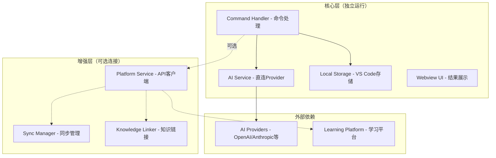
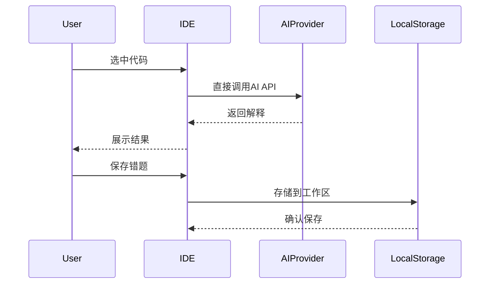
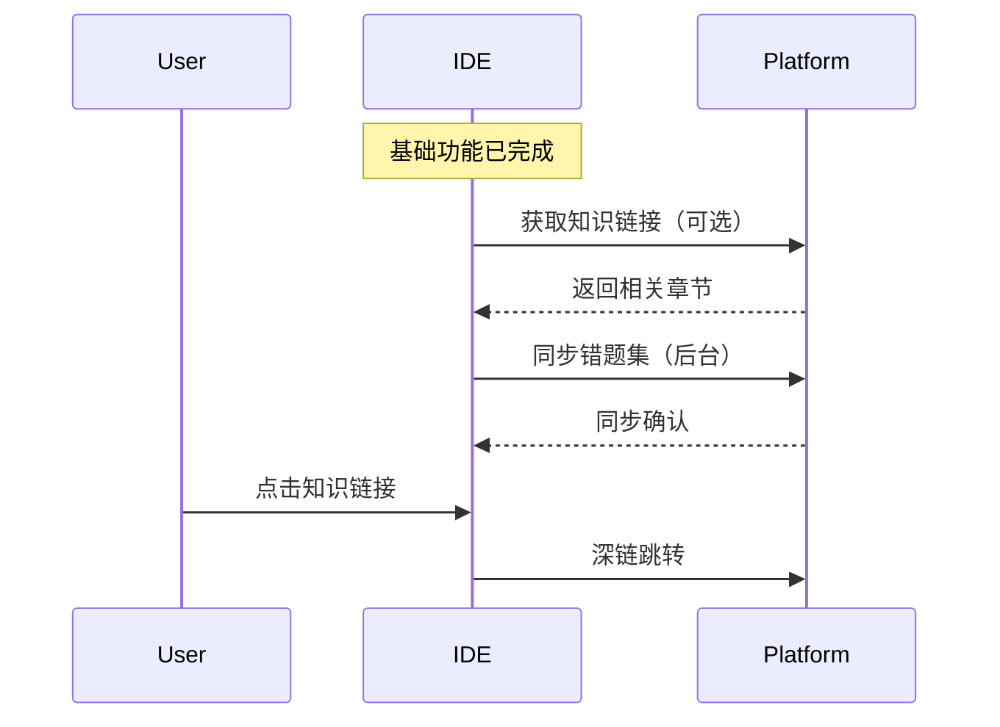

# PRD · IDE 插件增量式集成（基础功能独立，平台连接增强）

更新时间：2025-08-26
基于原始PRD（2025-08-25）的架构调整版本

TL;DR
- IDE插件基础功能（代码解释、本地错题集）独立运行，使用IDE端配置的AI Provider
- 连接学习平台后增强功能：知识链接推荐、深链跳转、错题集云同步
- 平台连接是可选的增值服务，断开后基础功能仍可用

## 一、范围与目标

### 目标
- **基础目标**：提供独立的代码解释和本地错题集功能，零依赖运行
- **增强目标**：通过可选的平台连接，实现知识体系关联和云端同步
- **设计原则**：基础功能独立、平台连接增强、故障优雅降级

### 非目标
- 首版不做团队协作功能
- 不要求离线AI模型（使用云端API）
- 不支持所有编程语言的深度AST分析（优先JS/TS、Python）

## 二、用户画像与核心场景

### 用户画像
1. **独立用户**：只需要AI代码解释，不关心学习平台
2. **学习用户**：希望将代码学习与系统化知识关联
3. **进阶用户**：需要错题集管理和跨设备同步

### 核心场景

#### 基础场景（无需平台）
- **B1 代码解释**：选中代码 → AI解释 → 本地展示
- **B2 本地收藏**：保存代码片段 → VS Code工作区存储 → 本地管理

#### 增强场景（需要平台）
- **E1 知识关联**：代码解释 + 相关知识点推荐 → 深链跳转学习
- **E2 云端同步**：本地错题集 → 自动同步到平台 → 跨设备访问
- **E3 学习闭环**：IDE实践 → 平台学习 → 回到IDE验证

## 三、架构设计

### 3.1 分层架构



### 3.2 数据流设计

#### 基础数据流（始终可用）


#### 增强数据流（平台连接时）


## 四、功能设计

### 4.1 配置结构

```typescript
interface LearnLinkerConfig {
  // 基础配置（必需）
  ai: {
    provider: 'openai' | 'anthropic' | 'deepseek' | 'doubao';
    apiKey: string;
    apiBase?: string;
    model?: string;
    timeout?: number;
  };
  
  // 存储配置（必需）
  storage: {
    enabled: boolean;  // 默认 true
    location: 'workspace' | 'global';  // 默认 workspace
    maxItems?: number;  // 最大存储条目
  };
  
  // 平台连接（可选）
  platform?: {
    enabled: boolean;
    url: string;
    token: string;
    features: {
      knowledgeLinks: boolean;  // 知识链接推荐
      snippetSync: boolean;     // 错题集同步
      autoSync: boolean;        // 自动同步
      syncInterval: number;     // 同步间隔（分钟）
    };
  };
}
```

### 4.2 功能可用性矩阵

| 功能 | 独立模式 | 平台连接模式 | 说明 |
|------|---------|-------------|-----|
| 代码解释 | ✅ 直接调用AI | ✅ 直接调用AI | 始终使用IDE配置的AI |
| 本地错题集 | ✅ VS Code存储 | ✅ VS Code存储 | 本地存储始终可用 |
| 错题集导出 | ✅ JSON/Markdown | ✅ JSON/Markdown | 支持多种格式导出 |
| 知识链接推荐 | ❌ | ✅ 调用/api/links | 需要平台语料库 |
| 深链跳转 | ❌ | ✅ 打开学习页面 | 需要平台页面 |
| 云端同步 | ❌ | ✅ 调用/api/snippets | 增量同步机制 |
| 历史记录 | ✅ 本地历史 | ✅ 本地+云端 | 云端提供更长历史 |

### 4.3 API设计

#### 基础功能API（无需平台）

**1. AI直连（替代原/api/chat）**
```typescript
// 直接调用配置的AI Provider
class AIService {
  async explain(request: {
    code: string;
    language: string;
    context?: string;
  }): Promise<ReadableStream<string>> {
    // 直接调用 OpenAI/Anthropic/DeepSeek API
  }
}
```

**2. 本地存储API**
```typescript
interface LocalSnippet {
  id: string;
  code: string;
  language: string;
  explanation?: string;
  tags: string[];
  createdAt: number;
  filePath?: string;
  isSynced?: boolean;  // 同步标记
}

class LocalStorage {
  async save(snippet: LocalSnippet): Promise<void>;
  async list(filter?: FilterOptions): Promise<LocalSnippet[]>;
  async delete(id: string): Promise<void>;
  async export(format: 'json' | 'markdown'): Promise<string>;
}
```

#### 增强功能API（需要平台）

**1. POST /api/links（知识链接）**
- 保持原设计，作为可选增强功能

**2. POST /api/snippets/sync（批量同步）**
```json
{
  "snippets": [
    {
      "localId": "local_123",
      "code": "...",
      "language": "javascript",
      "tags": ["async", "promise"],
      "createdAt": 1735173517123
    }
  ],
  "lastSyncTime": 1735173517000
}
```

响应：
```json
{
  "synced": ["local_123"],
  "conflicts": [],
  "serverTime": 1735173520000
}
```

## 五、实现策略

### 5.1 服务分离设计

```typescript
// 核心服务（独立）
class CoreServices {
  aiService: AIService;        // AI解释服务
  localStorage: LocalStorage;   // 本地存储
  uiService: UIService;         // UI渲染
}

// 平台服务（可选）
class PlatformServices {
  connectionManager: ConnectionManager;  // 连接管理
  knowledgeService: KnowledgeService;   // 知识链接
  syncService: SyncService;             // 同步服务
}

// 统一命令处理器
class CommandHandler {
  constructor(
    private core: CoreServices,
    private platform?: PlatformServices
  ) {}
  
  async explainSelection() {
    // 1. 基础功能
    const explanation = await this.core.aiService.explain(code);
    
    // 2. 增强功能（如果可用）
    let knowledgeLinks = null;
    if (this.platform?.isConnected()) {
      knowledgeLinks = await this.platform.knowledgeService.getLinks(code);
    }
    
    // 3. 统一展示
    this.core.uiService.show(explanation, knowledgeLinks);
  }
}
```

### 5.2 降级策略

```typescript
class PlatformService {
  async getKnowledgeLinks(code: string): Promise<SectionLink[] | null> {
    try {
      if (!this.isConnected()) return null;
      return await this.apiClient.post('/api/links', { code });
    } catch (error) {
      this.logger.warn('Failed to get knowledge links, degrading gracefully');
      return null;  // 降级：不显示知识链接
    }
  }
  
  async syncSnippets(snippets: LocalSnippet[]): Promise<void> {
    try {
      if (!this.isConnected()) {
        // 标记为未同步，等待下次连接
        this.markForSync(snippets);
        return;
      }
      await this.apiClient.post('/api/snippets/sync', { snippets });
    } catch (error) {
      this.logger.warn('Sync failed, will retry later');
      this.scheduleRetry(snippets);
    }
  }
}
```

### 5.3 状态管理

```typescript
interface ExtensionState {
  // 基础状态
  aiStatus: 'ready' | 'error' | 'processing';
  localSnippetsCount: number;
  
  // 平台状态
  platformConnection: 'connected' | 'disconnected' | 'connecting';
  pendingSyncCount: number;
  lastSyncTime?: number;
}

// 状态栏显示
// 独立模式：[Learn Linker: ✅ AI Ready | 📝 5 snippets]
// 连接模式：[Learn Linker: ✅ AI Ready | 🔗 Connected | ☁️ Synced]
```

## 六、开发里程碑

### Phase 1: 核心独立功能（4天）
- **Day 1-2**: AI Service实现，直连Provider
- **Day 2-3**: 本地存储和Webview UI
- **Day 3-4**: 命令集成和基础测试

### Phase 2: 平台连接层（3天）
- **Day 5**: 连接管理和认证
- **Day 6**: 知识链接服务集成
- **Day 7**: 同步服务实现

### Phase 3: 体验优化（2天）
- **Day 8**: 状态管理和UI优化
- **Day 9**: 错误处理和降级策略

### Phase 4: 测试与文档（1天）
- **Day 10**: 集成测试和文档完善

## 七、测试策略

### 独立模式测试
1. AI解释功能（无网络依赖平台）
2. 本地存储CRUD操作
3. 导入导出功能

### 连接模式测试
1. 平台连接和断开
2. 知识链接获取
3. 同步冲突处理
4. 网络异常恢复

### 降级测试
1. 平台不可用时基础功能正常
2. 同步失败时本地数据完整
3. 重连后自动恢复同步

## 八、成功指标

### 基础功能指标
- AI响应时间 < 2s（首字节）
- 本地存储操作 < 100ms
- 零依赖启动时间 < 1s

### 增强功能指标
- 知识链接匹配准确率 > 80%
- 同步成功率 > 95%
- 冲突解决满意度 > 90%

### 用户体验指标
- 独立模式可用性 100%
- 平台故障不影响基础功能
- 功能发现度 > 70%

## 九、风险与对策

| 风险 | 影响 | 对策 |
|-----|------|------|
| AI Provider限流 | 解释功能受限 | 多Provider支持、本地缓存 |
| 存储空间不足 | 无法保存新错题 | 自动清理策略、导出提醒 |
| 平台API变更 | 增强功能失效 | 版本协商、优雅降级 |
| 同步冲突 | 数据不一致 | 本地优先、手动解决 |

## 十、附录

### A. 配置示例

**纯独立模式：**
```json
{
  "learnLinker.ai.provider": "openai",
  "learnLinker.ai.apiKey": "sk-...",
  "learnLinker.storage.enabled": true
}
```

**平台连接模式：**
```json
{
  "learnLinker.ai.provider": "openai",
  "learnLinker.ai.apiKey": "sk-...",
  "learnLinker.storage.enabled": true,
  "learnLinker.platform.enabled": true,
  "learnLinker.platform.url": "http://localhost:3000",
  "learnLinker.platform.token": "pat_...",
  "learnLinker.platform.features.knowledgeLinks": true,
  "learnLinker.platform.features.snippetSync": true
}
```

### B. 变更记录
- 2025-08-26: 架构调整为增量式集成，基础功能独立
- 2025-08-25: 初始PRD版本