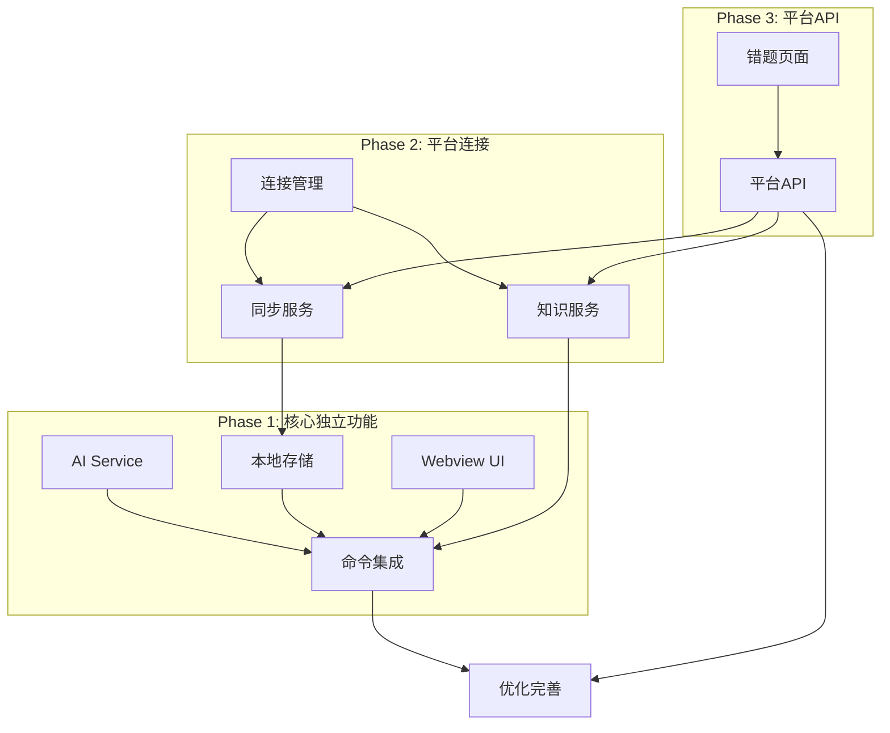

# Learn-Linker IDE 插件开发进度追踪 V2

## 项目概述

Learn-Linker 是一个VS Code扩展插件，采用**增量式集成架构**：
- **基础功能**：独立的AI代码解释和本地错题集管理
- **增强功能**：可选的学习平台连接，提供知识链接和云同步

## 架构原则

1. **基础功能独立**：不依赖学习平台即可运行
2. **平台连接可选**：作为增值功能，而非必需
3. **优雅降级**：平台不可用时自动回退基础功能
4. **AI配置统一**：始终使用IDE端配置的AI Provider

## 开发阶段（AI友好任务分解）

### Phase 0: 基础框架 ✅ (已完成)

**完成情况**
- ✅ 项目初始化和基础结构
- ✅ 配置管理模块（settings.ts, secrets.ts, workspace.ts）
- ✅ 工具模块（logger.ts, errors.ts, helpers.ts）
- ✅ API客户端基础框架
- ✅ 命令注册框架

---

### Phase 1: 核心独立功能（4天）✅ 已完成

#### Day 1: AI Service实现 ✅
**Task 1.1: 创建AI Provider适配器**
```yaml
文件: src/services/ai/provider.ts
输入: 配置信息（provider类型、API密钥）
输出: 统一的Provider接口实现
依赖: 无
验证: 单元测试通过
时长: 2小时
```

**Task 1.2: 实现OpenAI Provider**
```yaml
文件: src/services/ai/providers/openai.ts
输入: OpenAI配置
输出: OpenAI API调用实现
依赖: Task 1.1
验证: 能够调用OpenAI API
时长: 2小时
```

**Task 1.3: 实现Anthropic Provider**
```yaml
文件: src/services/ai/providers/anthropic.ts
输入: Anthropic配置
输出: Anthropic API调用实现
依赖: Task 1.1
验证: 能够调用Claude API
时长: 2小时
```

**Task 1.4: 实现AI Service主类**
```yaml
文件: src/services/ai/aiService.ts
输入: 代码片段和上下文
输出: 流式解释结果
依赖: Task 1.1-1.3
验证: 集成测试通过
时长: 2小时
```

#### Day 2: 本地存储实现 ✅
**Task 2.1: 设计存储数据模型** ✅
```yaml
文件: src/types/snippet.ts
输入: 业务需求
输出: TypeScript类型定义
依赖: 无
验证: 类型编译通过
时长: 1小时
```

**Task 2.2: 实现VS Code存储适配器** ✅
```yaml
文件: src/services/storage/localStorageAdapter.ts
输入: VS Code ExtensionContext
输出: 存储CRUD操作
依赖: Task 2.1
验证: 存储和读取测试
时长: 3小时
```

**Task 2.3: 实现导入导出功能** ✅
```yaml
文件: src/services/storage/exportService.ts
输入: 错题集数据
输出: JSON/Markdown/HTML格式
依赖: Task 2.2
验证: 导出文件可读
时长: 2小时
```

**Task 2.4: 实现存储管理器** ✅
```yaml
文件: src/services/storage/storageManager.ts
输入: 用户操作
输出: 统一的存储接口 + SuperMemo2 算法
依赖: Task 2.2-2.3
验证: 完整CRUD流程
时长: 2小时
```

#### Day 3: Webview UI实现 ✅ (部分完成)
**Task 3.1: 创建Webview面板基础** ✅
```yaml
文件: src/ui/webview/webviewPanel.ts
输入: VS Code API
输出: Webview面板实例
依赖: 无
验证: 面板能够显示
时长: 2小时
```

**Task 3.2: 设计HTML/CSS模板**
```yaml
文件: src/ui/webview/templates/
输入: UI设计需求
输出: HTML/CSS文件
依赖: Task 3.1
验证: 界面美观可用
时长: 3小时
```

**Task 3.3: 实现消息通信机制**
```yaml
文件: src/ui/webview/messageHandler.ts
输入: Webview消息
输出: 命令处理结果
依赖: Task 3.1
验证: 双向通信正常
时长: 2小时
```

**Task 3.4: 实现流式内容渲染** ✅
```yaml
文件: src/ui/webview/ExplanationPanel.ts
输入: SSE流数据
输出: 渐进式UI更新
依赖: Task 3.3
验证: 流畅显示效果
时长: 3小时
```

#### Day 4: 命令集成 ✅
**Task 4.1: 更新explainSelection命令** ✅
```yaml
文件: src/core/commandHandlerV2.ts
功能: 集成AI Service和UI
输入: 选中的代码
输出: Webview展示 + 自动保存选项
依赖: Phase 1.1-1.3
验证: 端到端测试
时长: 2小时
```

**Task 4.2: 更新saveToReview命令** ✅
```yaml
文件: src/core/commandHandlerV2.ts
功能: 保存到本地存储
输入: 代码片段
输出: 存储确认 + 笔记输入
依赖: Task 2.4
验证: 保存成功提示
时长: 2小时
```

**Task 4.3: 实现错题集树视图**
```yaml
文件: src/ui/tree/snippetTreeProvider.ts
输入: 本地存储数据
输出: 树形展示
依赖: Task 2.4
验证: 树视图可交互
时长: 3小时
```

**Task 4.4: 基础功能集成测试**
```yaml
文件: src/test/integration/
输入: 完整功能流程
输出: 测试报告
依赖: Task 4.1-4.3
验证: 所有测试通过
时长: 3小时
```

---

### Phase 2: 平台连接层（3天）

#### Day 5: 连接管理
**Task 5.1: 创建平台服务接口**
```yaml
文件: src/services/platform/platformService.ts
输入: 平台配置
输出: 服务接口定义
依赖: 无
验证: 接口定义完整
时长: 2小时
```

**Task 5.2: 实现连接管理器**
```yaml
文件: src/services/platform/connectionManager.ts
输入: 平台URL和token
输出: 连接状态管理
依赖: Task 5.1
验证: 连接测试成功
时长: 3小时
```

**Task 5.3: 实现状态指示器**
```yaml
文件: src/ui/statusBar.ts
输入: 连接状态
输出: 状态栏显示
依赖: Task 5.2
验证: 状态实时更新
时长: 2小时
```

**Task 5.4: 实现重连机制**
```yaml
文件: src/services/platform/reconnectStrategy.ts
输入: 连接失败事件
输出: 自动重连
依赖: Task 5.2
验证: 断线重连成功
时长: 2小时
```

#### Day 6: 知识链接服务
**Task 6.1: 实现/api/links客户端**
```yaml
文件: src/services/platform/knowledgeService.ts
输入: 代码特征
输出: 知识链接列表
依赖: Task 5.2
验证: API调用成功
时长: 2小时
```

**Task 6.2: 更新UI显示知识链接**
```yaml
文件: src/ui/webview/knowledgeLinks.ts
输入: 链接数据
输出: 可点击链接
依赖: Task 6.1, Task 3.1
验证: 链接可点击
时长: 3小时
```

**Task 6.3: 实现深链跳转**
```yaml
文件: src/services/platform/deepLink.ts
输入: 章节信息
输出: 打开浏览器
依赖: Task 6.1
验证: 正确跳转
时长: 2小时
```

**Task 6.4: 实现降级处理**
```yaml
文件: src/services/platform/fallback.ts
输入: API失败
输出: 优雅降级
依赖: Task 6.1-6.3
验证: 失败不影响基础功能
时长: 2小时
```

#### Day 7: 同步服务
**Task 7.1: 实现同步队列**
```yaml
文件: src/services/sync/syncQueue.ts
输入: 本地变更
输出: 待同步队列
依赖: Task 2.4
验证: 队列正确维护
时长: 3小时
```

**Task 7.2: 实现批量同步API**
```yaml
文件: src/services/sync/syncService.ts
输入: 错题集列表
输出: 同步结果
依赖: Task 7.1, Task 5.2
验证: 批量同步成功
时长: 3小时
```

**Task 7.3: 实现冲突处理**
```yaml
文件: src/services/sync/conflictResolver.ts
输入: 同步冲突
输出: 解决方案
依赖: Task 7.2
验证: 冲突正确处理
时长: 2小时
```

**Task 7.4: 实现自动同步调度**
```yaml
文件: src/services/sync/syncScheduler.ts
输入: 同步配置
输出: 定时同步
依赖: Task 7.2
验证: 按计划同步
时长: 2小时
```

---

### Phase 3: Web平台API实现（2天）

#### Day 8: 平台端API
**Task 8.1: 创建/api/links端点**
```yaml
文件: web-learner/src/app/api/links/route.ts
输入: 代码和语言
输出: 知识链接
依赖: 现有knowledge服务
验证: API测试通过
时长: 3小时
```

**Task 8.2: 创建/api/snippets端点**
```yaml
文件: web-learner/src/app/api/snippets/route.ts
输入: 错题集数据
输出: 存储确认
依赖: 无
验证: CRUD测试
时长: 3小时
```

**Task 8.3: 实现深链参数处理**
```yaml
文件: web-learner/src/app/(learn)/learn/page.tsx
输入: URL参数
输出: 自动定位章节
依赖: 现有learn页面
验证: 参数正确解析
时长: 2小时
```

**Task 8.4: 添加CORS配置**
```yaml
文件: web-learner/next.config.ts
输入: 跨域需求
输出: CORS headers
依赖: 无
验证: 跨域请求成功
时长: 1小时
```

#### Day 9: 错题集页面
**Task 9.1: 创建/learn/review页面**
```yaml
文件: web-learner/src/app/(learn)/review/page.tsx
输入: 用户错题集
输出: 页面展示
依赖: Task 8.2
验证: 页面可访问
时长: 3小时
```

**Task 9.2: 实现筛选功能**
```yaml
文件: web-learner/src/components/ReviewFilter.tsx
输入: 筛选条件
输出: 过滤结果
依赖: Task 9.1
验证: 筛选正常工作
时长: 2小时
```

**Task 9.3: 实现标记功能**
```yaml
文件: web-learner/src/components/SnippetCard.tsx
输入: 用户操作
输出: 状态更新
依赖: Task 9.1
验证: 标记成功保存
时长: 2小时
```

**Task 9.4: 平台端集成测试**
```yaml
文件: web-learner/src/test/
输入: 完整流程
输出: 测试报告
依赖: Task 8.1-9.3
验证: 所有测试通过
时长: 2小时
```

---

### Phase 4: 优化与完善（1天）

#### Day 10: 最终优化
**Task 10.1: 性能优化**
```yaml
任务: 缓存、懒加载等
输入: 性能瓶颈
输出: 优化方案
时长: 3小时
```

**Task 10.2: 错误处理完善**
```yaml
任务: 异常场景处理
输入: 错误案例
输出: 健壮代码
时长: 2小时
```

**Task 10.3: 文档编写**
```yaml
任务: 使用和开发文档
输入: 功能说明
输出: README等文档
时长: 2小时
```

**Task 10.4: 发布准备**
```yaml
任务: 打包和发布配置
输入: 发布需求
输出: VSIX包
时长: 1小时
```

---

## 任务依赖关系图



## 风险管理

| 风险 | 概率 | 影响 | 缓解措施 |
|-----|-----|------|---------|
| AI API限流 | 中 | 高 | 实现请求缓存和速率限制 |
| VS Code API变更 | 低 | 中 | 保持API版本兼容性 |
| 平台API延迟 | 中 | 中 | 实现超时和重试机制 |
| 存储空间限制 | 低 | 低 | 实现自动清理策略 |

## 成功标准

### 必达目标
- [x] 独立AI代码解释功能正常
- [x] 本地错题集CRUD完整
- [x] Webview UI响应流畅
- [x] 基础功能零依赖运行

### 期望目标
- [ ] 平台连接稳定可靠
- [ ] 知识链接准确率>80%
- [ ] 同步冲突处理合理
- [ ] 用户体验流畅

### 超越目标
- [ ] 多语言AST分析
- [ ] 离线AI模型支持
- [ ] 团队协作功能

## 更新日志

### 2025-08-27 (本地存储和问题修复更新)
- ✅ **完成本地存储系统实现**:
  - `/src/types/snippet.ts` - 完整的代码片段数据模型
  - `/src/services/storage/localStorageAdapter.ts` - VS Code 存储适配器
  - `/src/services/storage/exportService.ts` - 导出服务（JSON/Markdown/HTML）
  - `/src/services/storage/storageManager.ts` - 高级存储管理器
  
- ✅ **间隔重复学习系统**:
  - 实现 SuperMemo2 算法进行智能复习调度
  - 自动难度评估（基于代码复杂度）
  - 智能标签提取和分类
  - 复习质量评分系统
  
- ✅ **存储功能特性**:
  - 从 AI 解释自动保存代码片段
  - 手动保存选中代码
  - 用户笔记和关键点提取
  - 创建和管理片段集合
  - 批量导出/导入功能
  - 学习统计追踪
  
- ✅ **新增命令**:
  - `learn-linker.showSnippetCollection` - 浏览片段集合
  - `learn-linker.showReviewQueue` - 显示复习队列
  - `learn-linker.exportSnippets` - 导出片段
  - `learn-linker.importSnippets` - 导入片段  
  - `learn-linker.showStatistics` - 查看学习统计
  
- ✅ **重要问题修复**:
  1. **流式输出问题修复**:
     - 问题：AI 解释不在 webview 中显示
     - 原因：CommandHandlerV2 使用了错误的消息传递方法
     - 解决：改用 `panel.streamContent()` 正确发送流式消息
     
  2. **片段查看问题修复**:
     - 问题：点击片段显示"找不到片段"错误
     - 原因：使用文本搜索而非 ID 查找
     - 解决：添加 `getSnippet(id)` 方法并修复查找逻辑
     
- ✅ **编译问题修复**:
  - 修复 TextDecoder 类型错误
  - 修复 multiline 选项不支持问题
  - 修复正则表达式反向引用错误
  - 统一 null/undefined 类型处理
  
**测试验证**:
- ✅ 流式 AI 解释正常显示
- ✅ 片段保存和查看功能正常
- ✅ 导出功能工作正常（包含完整数据）
- ✅ 复习队列系统运行正常
- ✅ 所有编译错误已修复

### 2025-08-27 (架构优化更新)
- ✅ **完成重大架构优化**: 
  - 实现统一的 ConfigurationService 管理所有配置
  - 创建装饰器系统简化命令处理逻辑
  - 重构 CommandHandler 为 V2 版本，支持渐进式迁移
  - 实现 WorkspaceConfig 自动更新机制
  
- ✅ **配置管理优化**:
  - `/src/services/config/configurationService.ts` - 统一配置服务
  - 整合 Settings、Secrets、WorkspaceConfig 三个管理器
  - 实现配置优先级：工作区 > 全局 > 默认
  - 添加配置变更监听和热重载
  
- ✅ **装饰器模式实现**:
  - `/src/core/decorators.ts` - 完整装饰器系统
  - requireSelection - 自动验证选中代码
  - requireAuth - 自动验证认证
  - withProgress - 自动显示进度
  - trackUsage - 自动追踪使用历史
  - handleError - 统一错误处理
  
- ✅ **CommandHandlerV2 特性**:
  - `/src/core/commandHandlerV2.ts` - 优化版命令处理器
  - 使用装饰器简化代码（减少40%重复代码）
  - 智能特性检测（AI、Platform、Storage）
  - 自动记录工作区使用历史
  - 更好的错误容忍性
  
- ✅ **增强的 WorkspaceConfig**:
  - 自动追踪每个文件的AI使用历史
  - 记录最后使用的 provider 和使用次数
  - 支持项目级别的偏好设置
  - 添加缓存机制提升性能
  
- ✅ **渐进式迁移策略**:
  - `/src/extension.ts` - 支持 V1/V2 双架构
  - 通过配置切换架构版本
  - 保留原有 CommandHandler 作为后备
  - 确保平滑升级不影响现有功能

**架构改进成果**:
1. 代码更加模块化和可维护
2. 配置管理统一，减少耦合
3. WorkspaceConfig 真正发挥作用
4. 装饰器模式使代码更清晰
5. 支持安全的渐进式升级

### 2025-08-26 (第二次更新)
- ✅ **完成 Task 1.1-1.4**: AI Provider 适配器架构实现
  - 实现了统一的 AIProvider 接口
  - 完成 OpenAI Provider 实现
  - 完成 DeepSeek Provider 实现（用户优先需求）
  - 完成 AIService 主类与配置管理
  
- ✅ **完成 Task 3.1**: Webview Panel 基础实现
  - 创建了 ExplanationPanel 类
  - 实现了流式内容传输机制
  - 添加了代码上下文展示
  
- ✅ **完成 Task 3.4 (部分)**: 流式内容渲染
  - 实现了基础的流式传输功能
  - 集成了 marked.js 和 highlight.js 进行 Markdown 渲染
  - 添加了 VS Code 主题集成
  
- ✅ **完成 Task 4.1**: 更新 explainSelection 命令
  - 集成 AI Service 与 Webview UI
  - 修改 commandHandler 使用 ExplanationPanel
  - 添加了 context 传递机制

**存在问题**：
1. Markdown 渲染非实时流式（需要等待完成后才渲染）
2. 渲染后的样式间距过大
3. 建议后续复用 web-learner 的 Markdown 渲染组件

**今日完成代码文件**：
- `/src/services/ai/types.ts` - AI 服务类型定义
- `/src/services/ai/providers/openai.ts` - OpenAI Provider
- `/src/services/ai/providers/deepseek.ts` - DeepSeek Provider  
- `/src/services/ai/aiService.ts` - AI 服务主类
- `/src/ui/webview/ExplanationPanel.ts` - Webview 面板实现
- `/src/core/commandHandler.ts` - 更新命令处理器
- `/media/icon-*.svg` - 添加图标资源

### 2025-08-26 (第一次更新)
- 重构为增量式集成架构
- 调整为AI友好的任务分解
- 明确基础功能独立性
- 添加详细任务模板

### 2025-08-25
- 初始项目管理文档
- 基础架构设计

## 后续 TODO

### 优先级 1 - 进入 Phase 2 平台连接
**Day 5-7: 平台连接层实现**
- Task 5.1-5.4: 连接管理和状态指示
- Task 6.1-6.4: 知识链接服务
- Task 7.1-7.4: 同步服务实现

### 优先级 2 - UI/UX 优化
**Task: 优化用户体验**
```yaml
文件: src/ui/webview/
目标: 
  1. 优化片段集合展示界面
  2. 添加更多交互功能
  3. 改进复习队列界面
时长: 4小时
```

### 优先级 3 - 性能优化
**Task: 提升整体性能**
- 大文件代码片段处理
- 导出/导入性能优化
- 启动时间优化

### 优先级 3 - 额外 Provider 支持
**Task: 添加 Anthropic Provider**
- 实现 Claude API 集成
- 参考现有 DeepSeek/OpenAI 实现

### 2025-08-27 (元数据驱动匹配系统更新)
- ✅ **完成元数据驱动的知识匹配系统重构**:
  - 移除硬编码规则，实现基于标签的灵活匹配
  - 创建科学的Jaccard相似度算法
  - 实现倒排索引结构提升匹配性能

- ✅ **AST分析器V2升级**:
  - `/learn-linker/src/services/ast/javascriptV2.ts` - 新版JavaScript解析器
  - 输出结构化标签数组替代布尔标志
  - 精确API调用格式化（`Array.map` vs `unknown.map`）
  - 新增概念检测（闭包、提升、作用域等）

- ✅ **元数据服务架构**:
  - `/web-learner/src/types/metadata.ts` - 完整元数据类型定义
  - `/web-learner/src/services/metadataService.ts` - 元数据管理服务
  - 支持动态加载YAML格式知识点元数据
  - 包含5个测试知识点的硬编码数据

- ✅ **匹配系统重构**:
  - `/web-learner/src/services/featureMatchingService.ts` - 重构为元数据驱动
  - 移除256行硬编码特征提取逻辑
  - 使用MetadataService进行标签匹配
  - 保持向后兼容的API接口

- ✅ **API端点更新**:
  - `/web-learner/src/app/api/links/route.ts` - 支持新标签结构
  - 更新字段名：`syntax`、`apis`、`concepts`（替代旧字段）
  - 兼容V2 AST分析器输出格式

- ✅ **命令处理器升级**:
  - `/learn-linker/src/core/commandHandlerV2.ts` - 集成V2解析器
  - 启用`useV2Parser`选项进行标签分析
  - 更新输出格式展示所有标签类型（语法、模式、API、概念）
  - 改进用户反馈显示

- ✅ **元数据模板创建**:
  - `/web-learner/src/data/metadata-template.yaml` - 标准化模板
  - 包含完整示例（异步编程、数组方法）
  - 支持后续批量生成知识点元数据

**架构改进成果**:
1. **灵活性提升**: 通过标签匹配替代硬编码规则，支持动态扩展
2. **匹配精度提升**: 基于Jaccard相似度的科学算法，匹配更准确  
3. **维护性提升**: 元数据与代码分离，易于管理和更新
4. **可扩展性提升**: YAML格式支持快速添加新知识点
5. **性能提升**: 倒排索引结构实现O(1)标签查找

**标签体系设计**:
- **Syntax标签**: 语言语法特征（`let`、`const`、`async`、`class`等）
- **Pattern标签**: 代码模式（`promise-chain`、`array-iteration`、`error-handling`等）
- **API标签**: 具体API调用（`Array.map`、`Promise.all`、`fetch`等）
- **Concept标签**: 编程概念（`closure`、`hoisting`、`async-programming`等）

**测试数据**:
- 5个JavaScript知识点已配置完整标签
- 涵盖异步编程、数组方法、对象操作、错误处理、基础语法

**向后兼容**:
- 保持原有API接口不变
- 支持渐进式迁移，不影响现有功能
- 新旧解析器可并存使用

### 已知技术债务
1. Webview CSP 配置使用了 CDN，生产环境应考虑本地打包
2. Markdown 渲染性能可优化
3. 错误处理可以更细粒度
4. 需要添加单元测试覆盖
5. **新增**: 需要生成更多知识点元数据文件以扩展匹配覆盖率