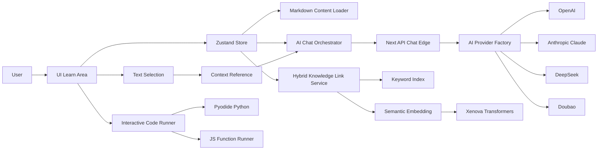
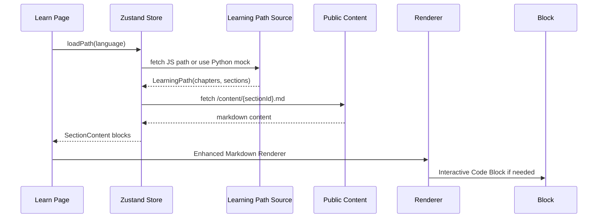

# My Dashboard App · 交互式学习与 AI 助手

本项目是基于 Next.js App Router 的「仪表盘 + 交互式学习平台」。它提供三栏式学习工作台（左侧导航 / 中间内容 / 右侧 AI 助手）、本地语义检索 + 关键词倒排索引的混合推荐、以及浏览器内 Python 与 JavaScript 的交互式代码执行能力。

关键页面与入口：
- 学习区三栏布局： [src/app/(learn)/layout.tsx](src/app/(learn)/layout.tsx)
- 学习内容页： [src/app/(learn)/learn/page.tsx](src/app/(learn)/learn/page.tsx)
- 首页仪表盘： [src/app/page.tsx](src/app/page.tsx)
- 设置页（React Hook Form + Zod 示例）： [src/app/settings/page.tsx](src/app/settings/page.tsx)
- AI 聊天 API（Edge runtime）： [src/app/api/chat/route.ts](src/app/api/chat/route.ts)
- 根布局与语义模型预加载： [src/app/layout.tsx](src/app/layout.tsx), [src/components/SemanticModelPreloader.tsx](src/components/SemanticModelPreloader.tsx)


功能特性

- 学习工作台三栏布局
  - 可拖拽分栏，左右栏支持独立折叠；大屏启用三栏，小屏自动显示中栏内容
  - 学习区专用布局由路由分组提供： [src/app/(learn)/layout.tsx](src/app/(learn)/layout.tsx)
- 学习路径与章节内容加载
  - Python 使用内置模拟课程结构
  - JavaScript 从公开 Markdown 路径图解析构建： [public/javascript-learning-path.md](public/javascript-learning-path.md)
  - 章节内容存放于： [public/content](public/content)
  - 内容块支持 Markdown 与交互式代码块（在 fenced 代码块语言后添加 :interactive 后缀）
- 文本勾画一键引用到 AI 问题
  - 鼠标选中或快捷键 Cmd/Ctrl+L 将所选 Markdown 或代码片段作为上下文发送给 AI
  - 实现： [src/hooks/useTextSelection.ts](src/hooks/useTextSelection.ts)
- AI 对话与会话管理
  - 多会话管理（新建/切换/重命名/删除），回车发送、Shift+Enter 换行、自动滚动到底
  - 右栏 AI 辅助面板： [src/components/AIChatSidebar.tsx](src/components/AIChatSidebar.tsx)
- 知识点链接推荐（AI 回复下方标签跳转）
  - 基于“关键词倒排索引 + 语义相似度”的混合匹配
  - 实现： [src/services/knowledgeLinkService.ts](src/services/knowledgeLinkService.ts), [src/services/hybridKnowledgeLinkService.ts](src/services/hybridKnowledgeLinkService.ts), [src/services/semanticService.ts](src/services/semanticService.ts)
- 交互式代码执行
  - Python：浏览器内 Pyodide 运行，捕获 stdout 与错误回溯： [src/services/pyodideService.ts](src/services/pyodideService.ts)
  - JavaScript：Function 沙箱执行，注入自定义 console 收集输出： [src/components/InteractiveCodeBlock.tsx](src/components/InteractiveCodeBlock.tsx)
  - 编辑器：CodeMirror，支持搜索高亮、复制、重置、输出面板： [src/components/CodeMirrorCodeBlock.tsx](src/components/CodeMirrorCodeBlock.tsx)
- 增强 Markdown 渲染
  - React Markdown + remark-gfm + remark-math + rehype-katex
  - 将部分代码块直达交互执行： [src/components/EnhancedMarkdownRenderer.tsx](src/components/EnhancedMarkdownRenderer.tsx)
- 学习进度与收藏
  - 章节完成/收藏，记录时间并持久化： [src/store/learningStore.ts](src/store/learningStore.ts)
- 预加载与性能
  - requestIdleCallback 空闲预加载 Transformer 模型
  - 自动在学习路径加载后初始化混合知识链接服务
  - 简易性能监控工具： [src/utils/performance.ts](src/utils/performance.ts)


技术架构与关键实现

- 路由与布局
  - App Router + 路由分组 (learn)，学习区使用专用三栏布局
  - 根布局注入 Header 与语义模型预加载： [src/components/PageLayout.tsx](src/components/PageLayout.tsx), [src/components/SemanticModelPreloader.tsx](src/components/SemanticModelPreloader.tsx)
- 状态管理（Zustand + persist）
  - 统一管理学习路径、章节内容、会话、AI 提供商、Pyodide 状态、用户进度、字体大小、选中文本等： [src/store/learningStore.ts](src/store/learningStore.ts)
  - 应用启动即加载 Python 与 JavaScript 的学习路径；首次无会话时创建默认会话
- AI 聊天（Edge Runtime + Provider 工厂）
  - API： [src/app/api/chat/route.ts](src/app/api/chat/route.ts) 使用 Edge runtime，返回 SSE 流
  - Provider 工厂与类型： [src/services/ai/index.ts](src/services/ai/index.ts), [src/services/ai/types.ts](src/services/ai/types.ts)
  - 提供商适配（解析流格式差异）：
    - OpenAI： [src/services/ai/providers/openai.ts](src/services/ai/providers/openai.ts)
    - Anthropic： [src/services/ai/providers/anthropic.ts](src/services/ai/providers/anthropic.ts)
    - DeepSeek（OpenAI 兼容协议）： [src/services/ai/providers/deepseek.ts](src/services/ai/providers/deepseek.ts)
    - 豆包： [src/services/ai/providers/doubao.ts](src/services/ai/providers/doubao.ts)
- 知识链接服务（Hybrid）
  - 关键词倒排索引：解析中英关键词与术语词典，构建 term→section 映射： [src/services/knowledgeLinkService.ts](src/services/knowledgeLinkService.ts)
  - 语义匹配：@xenova/transformers 生成嵌入；优先 BAAI/bge-small-zh-v1.5，失败回退 all-MiniLM-L6-v2： [src/services/semanticService.ts](src/services/semanticService.ts)
  - 融合策略：关键词权重 0.4、语义权重 0.6、质量阈值 0.65、多样性控制；向量 localStorage 缓存： [src/services/hybridKnowledgeLinkService.ts](src/services/hybridKnowledgeLinkService.ts), [src/lib/vectorCache.ts](src/lib/vectorCache.ts)
- 交互式代码执行
  - Python：Pyodide v0.26.4 CDN 延迟加载，覆盖 print 捕获 stdout/stderr，错误格式化统一： [src/services/pyodideService.ts](src/services/pyodideService.ts)
  - JS：Function 包裹 + 自定义 console；输出面板滚动展示： [src/components/InteractiveCodeBlock.tsx](src/components/InteractiveCodeBlock.tsx)
  - 编辑器：CodeMirror 动态主题、行高亮、搜索命中高亮： [src/components/CodeMirrorCodeBlock.tsx](src/components/CodeMirrorCodeBlock.tsx)
- Markdown 渲染增强
  - 静态高亮（简化实现）： [src/components/SyntaxHighlighter.tsx](src/components/SyntaxHighlighter.tsx)
  - 聊天消息渲染与代码展示： [src/components/ChatMessageRenderer.tsx](src/components/ChatMessageRenderer.tsx), [src/components/StaticCodeBlock.tsx](src/components/StaticCodeBlock.tsx)
- COOP/COEP 与构建配置
  - 为启用 SharedArrayBuffer（Pyodide 需求），通过 next.config 注入响应头： [next.config.ts](next.config.ts)
    - Cross-Origin-Embedder-Policy: credentialless
    - Cross-Origin-Opener-Policy: same-origin
  - Webpack 客户端侧禁用 fs/path fallback，并忽略 cherry-studio 目录


架构图

整体数据流



学习内容加载与渲染




目录与内容结构

- 学习路径与内容
  - JavaScript 路径定义： [public/javascript-learning-path.md](public/javascript-learning-path.md)
  - 章节内容示例： [public/content/js-sec-1-1-hello-world.md](public/content/js-sec-1-1-hello-world.md), [public/content](public/content)
  - Python 章节示例： [public/content/python-sec-1-1-variables.md](public/content/python-sec-1-1-variables.md)
- 核心源文件
  - 布局与页面： [src/app/(learn)/layout.tsx](src/app/(learn)/layout.tsx), [src/app/(learn)/learn/page.tsx](src/app/(learn)/learn/page.tsx), [src/app/page.tsx](src/app/page.tsx), [src/app/settings/page.tsx](src/app/settings/page.tsx)
  - 组件： [src/components/AIChatSidebar.tsx](src/components/AIChatSidebar.tsx), [src/components/ContentDisplay.tsx](src/components/ContentDisplay.tsx), [src/components/EnhancedMarkdownRenderer.tsx](src/components/EnhancedMarkdownRenderer.tsx), [src/components/InteractiveCodeBlock.tsx](src/components/InteractiveCodeBlock.tsx)
  - 服务： [src/services/semanticService.ts](src/services/semanticService.ts), [src/services/hybridKnowledgeLinkService.ts](src/services/hybridKnowledgeLinkService.ts), [src/services/knowledgeLinkService.ts](src/services/knowledgeLinkService.ts), [src/services/pyodideService.ts](src/services/pyodideService.ts)
  - 聊天与提供商： [src/app/api/chat/route.ts](src/app/api/chat/route.ts), [src/services/ai/index.ts](src/services/ai/index.ts), [src/services/ai/providers](src/services/ai/providers)
  - 状态： [src/store/learningStore.ts](src/store/learningStore.ts)
  - 配置： [next.config.ts](next.config.ts), [package.json](package.json)


运行与开发

- 要求
  - Node.js 版本需与 Next.js 15 兼容
- 安装与启动

```bash
npm install
npm run dev
# 打开 http://localhost:3000
```

- 生产构建与启动

```bash
npm run build
npm start
```


环境变量与 AI 提供商

- 可配置项（存在即视为可用）： [src/services/ai/index.ts](src/services/ai/index.ts)
  - OPENAI_API_KEY, OPENAI_MODEL, OPENAI_API_BASE
  - ANTHROPIC_API_KEY, ANTHROPIC_MODEL, ANTHROPIC_API_BASE
  - DEEPSEEK_API_KEY, DEEPSEEK_MODEL, DEEPSEEK_API_BASE
  - DOUBAO_API_KEY, DOUBAO_MODEL, DOUBAO_API_BASE

- 本地开发可使用 .env.local：

```ini
OPENAI_API_KEY=sk-...
OPENAI_MODEL=gpt-4o-mini
OPENAI_API_BASE=https://api.openai.com/v1

ANTHROPIC_API_KEY=sk-ant-...
ANTHROPIC_MODEL=claude-3-5-sonnet-20240620
ANTHROPIC_API_BASE=https://api.anthropic.com/v1

DEEPSEEK_API_KEY=sk-deepseek-...
DEEPSEEK_MODEL=deepseek-chat
DEEPSEEK_API_BASE=https://api.deepseek.com/v1

DOUBAO_API_KEY=volc-...
DOUBAO_MODEL=doubao-lite-4k
DOUBAO_API_BASE=https://maas-api.ml-platform-cn-beijing.volces.com
```


跨源隔离（COOP/COEP）与 Pyodide

- 已在 Next 配置中注入响应头： [next.config.ts](next.config.ts)
  - Cross-Origin-Embedder-Policy: credentialless
  - Cross-Origin-Opener-Policy: same-origin
- 若部署到其他平台（如 Vercel），需确保平台层未覆盖或剥离上述响应头，以保证 SharedArrayBuffer 生效，否则 Pyodide 将无法工作


安全与注意事项

- Provider 安全
  - 请勿将 API Key 写入仓库。建议仅通过环境变量配置
  - DeepSeek Provider 代码中存在硬编码的默认 API Key 字符串，尽管 isConfigured 依赖环境变量不会实际启用，但该字符串不应出现在仓库中，建议移除或改为占位： [src/services/ai/providers/deepseek.ts](src/services/ai/providers/deepseek.ts)
- 浏览器内代码执行
  - JavaScript 通过 Function 执行，受同源策略限制，但仍不应粘贴/运行不可信代码片段
- 流式输出与网络
  - SSE 需网络链路与代理支持保持连接与不缓冲；如遇断流可检查反向代理与 CDN 配置


技术栈

- Next.js 15（App Router）、React 19
- Zustand（含 persist）
- React Hook Form + Zod
- UI：shadcn-ui（Radix UI）、lucide-react
- Markdown 与数学：react-markdown、remark-gfm、remark-math、rehype-katex
- 代码编辑与高亮：@uiw/react-codemirror、@codemirror/*、自定义简化高亮
- 语义检索：@xenova/transformers、onnxruntime-web
- Python 运行：Pyodide


已知局限与后续改进

- 语义索引目前主要来自标题，后续可解析正文摘要（content preview）以提升召回
- Hybrid 融合阈值与权重为经验值，需结合真实数据调优
- 移动端布局暂为单列渲染，后续可完善手机与平板适配


版权与许可

本项目使用到的第三方服务与模型的版权归其各自所有；如用于生产，请遵守各服务条款并配置合理的限流与监控。
